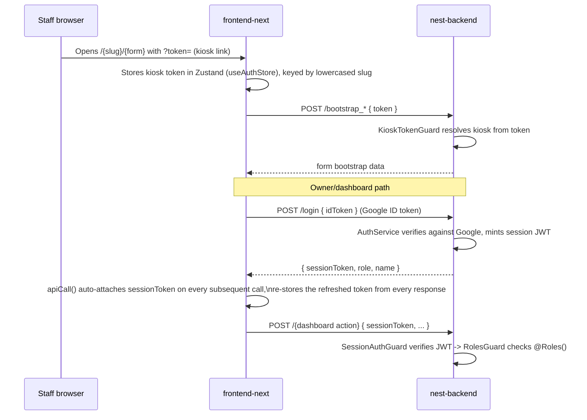

# ARCHITECTURE.md

Covers the **new stack** (`nest-backend` + `frontend-next`) in depth. For the legacy stack's
architecture, see `CLAUDE.md`'s "Backend architecture" / "Frontend architecture" sections — it is
accurate and not re-derived here.

## High-level shape

```mermaid
flowchart LR
    Staff[Kiosk staff browser] -->|HTTPS, kiosk token| FE[frontend-next\nNext.js App Router]
    Owner[Owner/dashboard browser] -->|HTTPS, session token| FE
    FE -->|POST /{action}\none route per action| BE[nest-backend\nNestJS]
    BE -->|Prisma over pg.Pool| DB[(Postgres / Neon)]
    BE -->|SMTP| Mail[mailer]
    BE -->|Anthropic API| Claude[Invoice line-item extraction]
    FE -->|POST /api/process-now| Relay[Next.js route handler]
    Relay -->|server-side POST| BE
```

## Request routing — one route per action, not a dispatcher

Unlike the legacy backend's single `doPost` + `action` field dispatch, **every nest-backend
action is its own HTTP route** (`POST /submit`, `POST /confirm_invoice_review`, etc. — see
`ENDPOINTS.md` for the full list). `frontend-next/lib/api.js`'s `apiCall(action, data)` posts to
`${BACKEND_URL}/${action}` with the session token folded into the body (not an Authorization
header — see `AUTH.md`).

## Auth flow (new stack)



Full detail in `AUTH.md`.

## Data access

All new-stack persistence goes through Prisma (`nest-backend/src/prisma/prisma.service.ts`)
against a real Postgres (Neon) database — not the legacy Google Sheet. `PrismaService` wraps a
hand-constructed `pg.Pool` with `idleTimeoutMillis: 0` (see code comment) specifically to avoid
paying Neon's compute-suspend wake latency (~3s) on every gap between dashboard page loads —
**do not "simplify" this back to a bare connection string**, that regression has already been
guarded against once in code comments.

`prisma/schema.prisma` is a deliberate 1:1 port of the legacy Google Sheet's shape: `snake_case`
field names (not Prisma's usual camelCase), and enum-like columns stay plain `String` (backed by
the owner-editable `enum_option` table at runtime) rather than Prisma enums — confirmed: **zero**
`enum` blocks exist in the schema (see `DATABASE.md`).

## Global request pipeline (nest-backend)

Registered once in `AppModule`, applied to every route unless opted out:

1. `SessionAuthGuard` (`APP_GUARD`) — resolves `request.user` from `body.sessionToken`. Opt out
   with `@Public()`.
2. `RolesGuard` (`APP_GUARD`) — checks `@Roles(...)` on the handler/class against `request.user`.
3. `ResponseEnvelopeInterceptor` (`APP_INTERCEPTOR`) — normalizes every success response shape.
4. `HttpExceptionFilter` (`APP_FILTER`) — normalizes every error response shape (this is why
   every `apiCall()` result has a consistent `{ ok, ... }` or `{ ok: false, error }` shape on the
   frontend).

Kiosk-token-gated routes (`bootstrap_*`, `submit`) additionally use `KioskTokenGuard` and expose
the resolved kiosk/user via `@CurrentKiosk()`/`@CurrentUser()` param decorators
(`src/common/decorators/`).

## Async submission pipeline

`src/pipeline/` — mirrors the legacy `api/Pipeline.js` async-intake model: form submissions
(`POST /submit`) are queued (`Submission` table) and processed by processors under
`src/pipeline/processors/` (one per form type, e.g. `delivery-invoice.processor.ts`). A
`kickProcessing()` call from the frontend right after submit nudges immediate processing; a
scheduled sweep (`@nestjs/schedule`, `ScheduleModule.forRoot()` in `AppModule`) is the fallback.
`POST /process_now` + `frontend-next/app/api/process-now/route` is the Next.js equivalent of the
legacy `frontend/api/process-now.js` relay — a server-side nudge that survives the browser tab
closing.

## Stock ledger — the one piece of math worth understanding before touching money/stock code

`stock_movement` rows (`movement_type`, `direction: IN|OUT`, `qty`) are the single source of
truth for "how much of item X is at kiosk Y right now." `stockBalanceAsOf()`
(`src/common/stock-balance.util.ts`) is the canonical balance function — it sums `qty` signed by
`direction`, filtered only by `stock_item_id` and an optional `asOfDate` cutoff, **regardless of
`movement_type`**. It backs purchasing recommendations, stocktake reconciliation, and stock
variance calculations.

**Gotcha (verified in code, worth remembering):** `KpiService.computeStockUsageLedger()`'s
"Deliveries In" / "Transfers In" / "Transfers Out" display buckets are keyed by `movement_type`
string match (`if (m.movement_type === "DELIVERY_IN") deliveriesIn += qty`), not by `direction`,
for most types. This is safe only because, by convention, each of those movement types has
always been posted with one fixed direction. When `DELIVERY_CORRECTION` was introduced (see
`DECISIONS.md`), this bucket had to be explicitly taught to respect `direction` for that new
type — a future new movement_type must get the same treatment or the KPI display will silently
miscount it, even though `stockBalanceAsOf` (the real stock-on-hand truth) would still be
correct. See `CONVENTIONS.md`.

## Deployment architecture

No deploy tooling exists yet for the new stack (no CI config, no `vercel.json` found under
`frontend-next/`). See `DEPLOYMENT.md`.

## Caching

`TableCacheService` (`src/reference-data/`) — an in-process cache over reference/lookup tables
(kiosks, stock items, products, categories, etc.), invalidated via `invalidate()` / the
`/refresh_cache` dashboard-settings action after direct-DB or bulk-import changes. No
distributed cache (Redis etc.) found in the repo.

## Storage

`src/upload/` — file uploads (photos/videos from kiosk forms, invoice images). UNKNOWN —
needs inspection: exact storage backend (local disk vs. cloud bucket) was not confirmed this
pass; check `upload.service.ts` and the `StoredFile` Prisma model before relying on an
assumption here.
